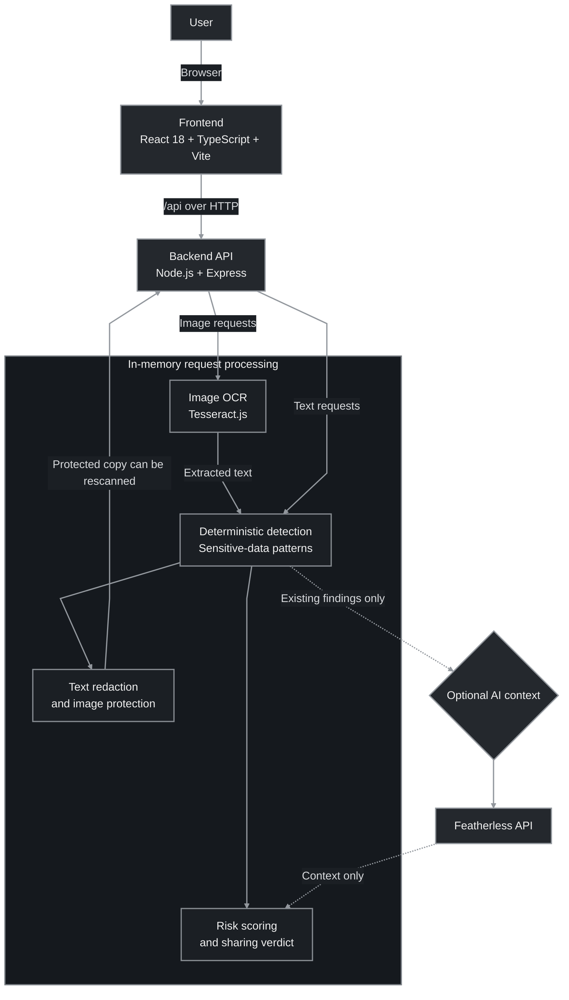

<div align="center">

# PrivacyGuard

### Know what you’re sharing. Keep sensitive information private.

Scan text and images before they leave your hands. PrivacyGuard finds sensitive details, explains
the risks, helps protect what it can, and lets you check the result again.

<p>
  <a href="https://react.dev/"></a>
  <a href="https://www.typescriptlang.org/"></a>
  <a href="https://vite.dev/"></a>
  <a href="https://expressjs.com/"></a>
  <a href="https://github.com/naptha/tesseract.js"></a>
  <a href="https://www.npmjs.com/package/jimp"></a>
  <a href="https://nodejs.org/"></a>
</p>

[Quickstart](#quickstart) · [Architecture](#architecture) · [Screenshots](#screenshots)

</div>

## The problem

Everyday messages, support tickets, screenshots, and configuration snippets can quietly expose
email addresses, phone numbers, credentials, API keys, or other private details. It is easy to
miss them before clicking **Send**—and image text is especially easy to overlook.

**PrivacyGuard is a last check before sharing:** deterministic detection highlights what may be
sensitive, risk guidance explains why it matters, and protection tools help you make a safer copy.
Optional AI adds context to existing findings; it does not decide what the detector finds.

## What you can do

- **Scan text and images** for emails, phone numbers, payment cards, IP addresses, URLs, keys,
  tokens, credentials, and postal addresses.
- **Understand the risk** with a score, a clear verdict, and practical guidance.
- **Protect and verify:** redact text or cover detected image regions, then rescan the result.
- **Keep content private:** requests are processed in memory and are not saved to a database.

> OCR can miss text, and pattern-based detection is not perfect. Review the original and every
> protected result yourself before sharing. An image OCR cannot read is marked for manual review,
> not assumed safe.

## Architecture



The API has no database: submitted content is handled in memory. The optional AI provider can
explain existing detector findings, but cannot add findings or change their locations.

## Quickstart

**You’ll need:** Node.js 20.11+ and npm.

```bash
git clone https://github.com/Tayyaba-Amin/PrivacyGuard.git
cd PrivacyGuard
npm install
npm run dev
```

Open **http://localhost:5173**. The API runs at **http://127.0.0.1:4000**. No API key is needed
for scanning; deterministic analysis works without the optional AI context provider.

<details>
<summary>Enable optional AI explanations</summary>

Copy `.env.example` to `.env`, then add your `FEATHERLESS_API_KEY`. Keep `.env` private and never
commit it.

</details>

<details>
<summary>More commands</summary>

```bash
npm test          # backend tests
npm run typecheck # check server and web types
npm run build     # production build
```

</details>

## Screenshots

<details>
<summary>Explore the app screens</summary>

### Landing page


### Dashboard


### Text analysis


### Image analysis


### Text results


### Image results


### Protected copies


### History


</details>

## Privacy and limitations

PrivacyGuard is a demo, not a guarantee of safety. Image protection covers detected OCR regions;
it does not reconstruct what was underneath. The application has no authentication or
production-grade deployment hardening, so do not deploy it publicly as-is.
