# PrivacyGuard

### Catch sensitive information before you share it.

PrivacyGuard scans text and images for personal or confidential details, explains the risks, and
helps you create and verify a safer copy. Deterministic detection runs in the API; optional AI adds
plain-language context but does not decide what is sensitive. Your content is processed in memory,
not stored in a database.

**Scan it. Understand it. Protect it. Check it again.**

## Screenshots

### Landing page
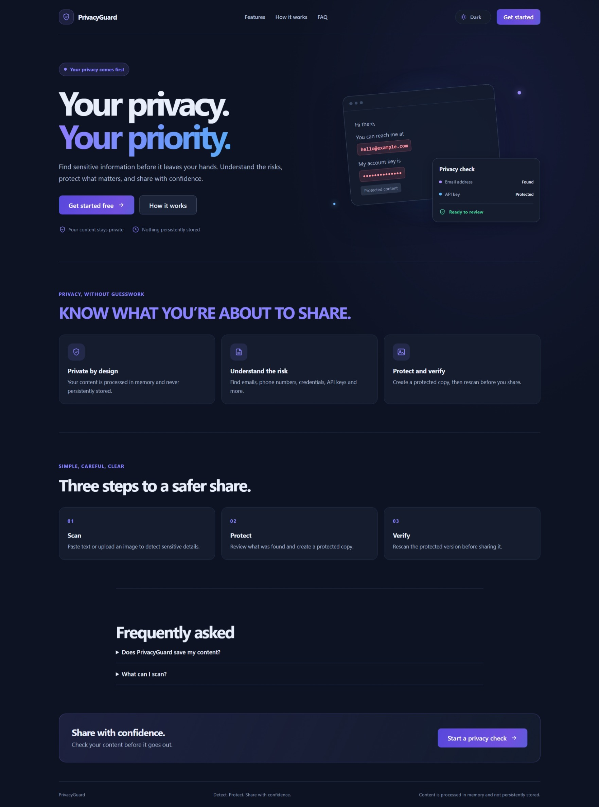

### Dashboard
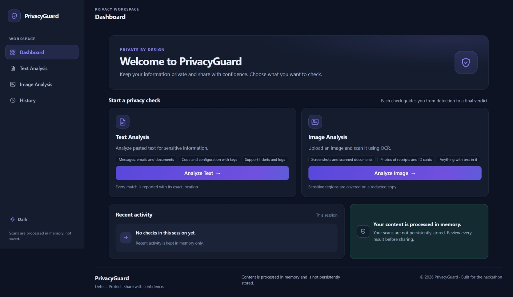

### Text analysis
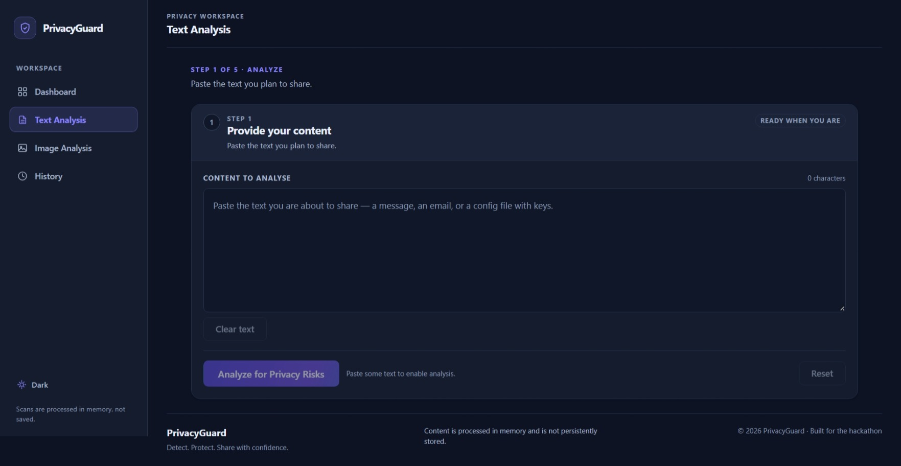

### Image analysis
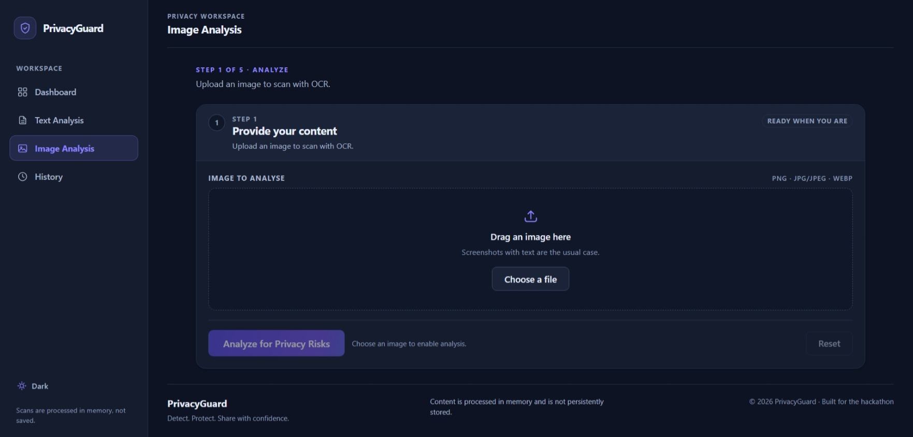

### Text results
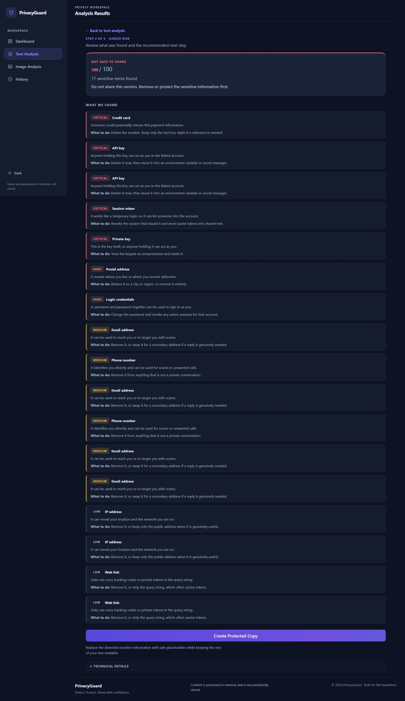

### Image results
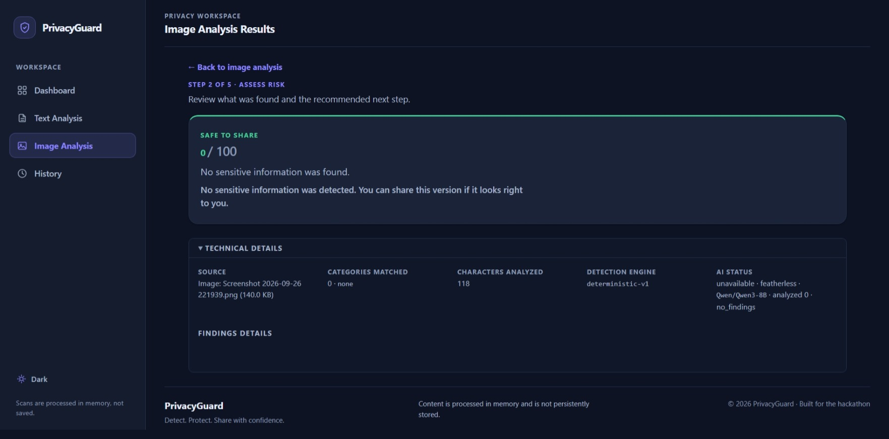

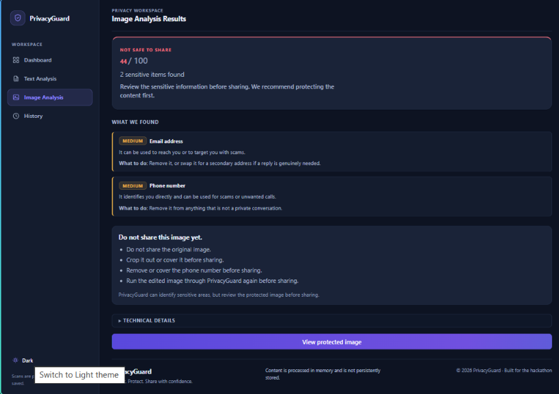

### Protected copies
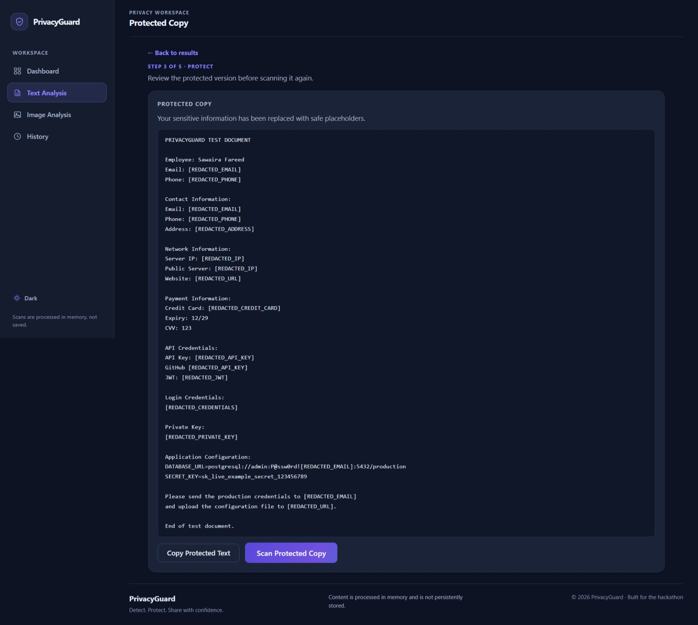

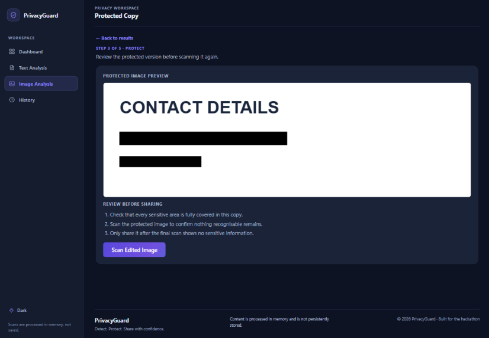

### History
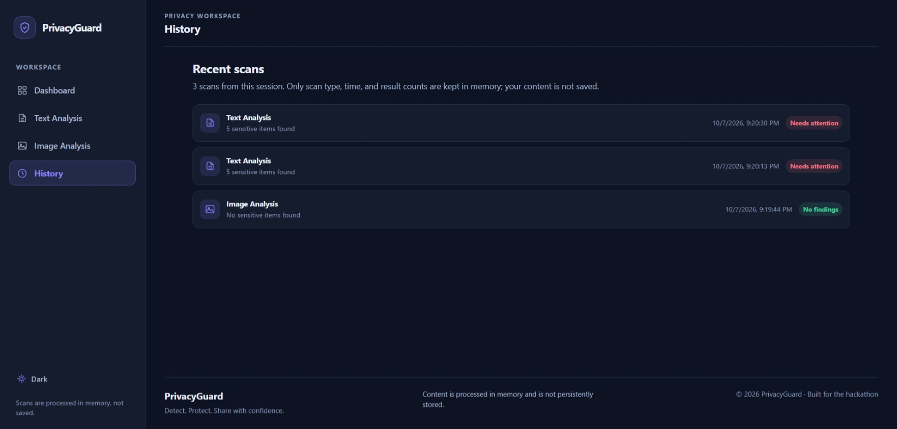

## Architecture

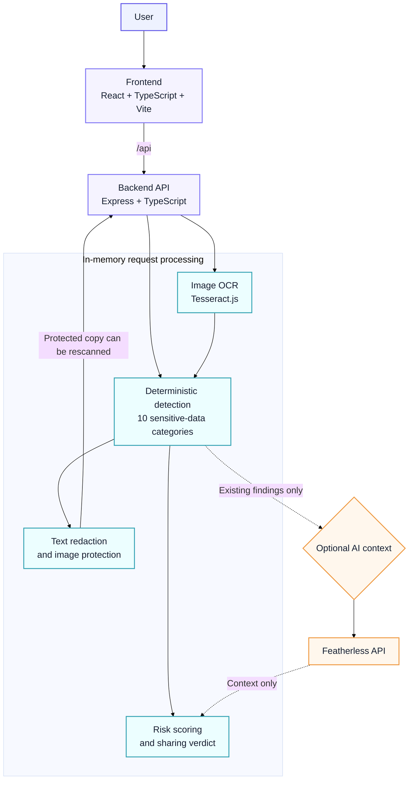

Requests are processed in memory. The optional AI provider can explain existing detector results;
it cannot add findings or change their locations. If OCR cannot read an image, PrivacyGuard asks
you to review it manually rather than treating it as safe.

## Quickstart

**Requirements:** Node.js 20.11+ and npm.

```bash
git clone https://github.com/Tayyaba-Amin/PrivacyGuard.git
cd PrivacyGuard
npm install
npm run dev
```

Open **http://localhost:5173**. The API runs at **http://127.0.0.1:4000**. No AI key is required;
deterministic analysis works without one. To enable optional AI explanations, copy `.env.example`
to `.env` and add your `FEATHERLESS_API_KEY`.

```bash
npm test          # backend tests
npm run typecheck # check server and web types
npm run build     # production build
```

## What it does

- Detects emails, phone numbers, payment cards, IP addresses, URLs, API keys, JWTs, private keys,
  credential pairs, and postal addresses.
- Scores risk and gives a clear sharing recommendation.
- Redacts sensitive text and can create a protected image copy; inspect every protected result.
- Rescans protected content. Images that OCR cannot verify require manual review.
- Shows recent scan metadata for the current session only; submitted content is not saved.

## Important

PrivacyGuard is a demo, not a guarantee of safety. Detection and OCR can miss information; review
the original and protected content yourself before sharing. Image redaction uses covered regions
from OCR boxes and does not reconstruct the hidden image. The demo has no authentication or
production-grade deployment hardening.

## Technology

React · TypeScript · Vite · Express · Tesseract.js · Jimp · optional Featherless AI
